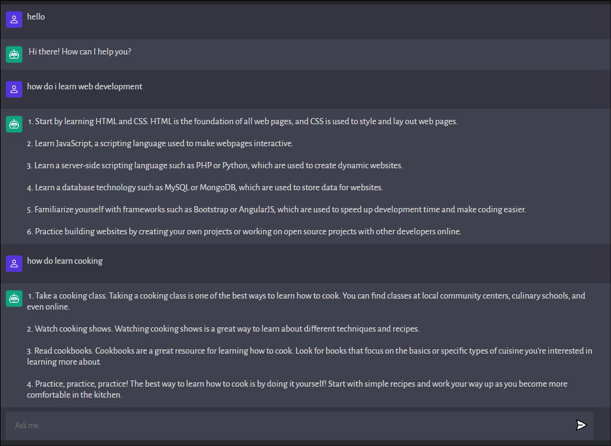

 # [**chatbot-v1**](https://chatbot-v1.vercel.app/)

Created using

#

Thanks to [*OPENAI API*](https://openai.com/api/), creating chat-bots has become super easy.

The model used in this project is the [GPT-3](https://beta.openai.com/docs/models/gpt-3) text-davinci-003 model. 
Which is the latest and can do any task that other models can do.
#
Backend (server side) has been deployed using [render](https://render.com/)

And the Frontend (client side) is deployed using 

